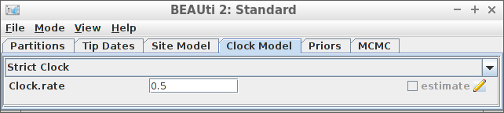

# babette_example_8

Branch   |[](https://travis-ci.org)                                                                                           |[](https://appveyor.com)                                                                                               
---------|--------------------------------------------------------------------------------------------------------------------------------------------------------|--------------------------------------------------------------------------------------------------------------------------------------------------------------------------------------------
`master` |[](https://travis-ci.org/richelbilderbeek/babette_example_8) |[](https://ci.appveyor.com/project/richelbilderbeek/babette-example-8/branch/master)
`develop`|[](https://travis-ci.org/richelbilderbeek/babette_example_8)|[](https://ci.appveyor.com/project/richelbilderbeek/babette-example-8/branch/develop)

A [babette example](https://github.com/richelbilderbeek/babette_examples).

## Example #8: Strict clock with a known clock rate



```{r}
posterior <- bbt_run(
  "my_alignment.fas",
  clock_model = create_strict_clock_model(
    clock_rate_param = create_clock_rate_param(value = 0.5)
  ) 
)
```

Thanks to Paul van Els and Yacine Ben Chehida for this use case.

All other parameters are set to their defaults, as in BEAUti.

## Result


